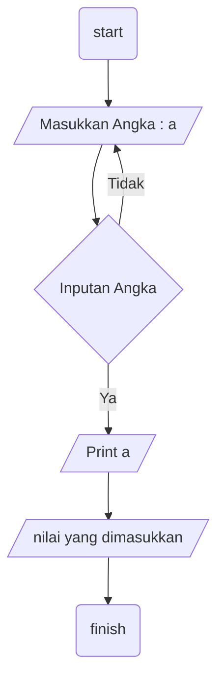

```mermaid
  flowchart TD;

  A(start) --> B[/Masukkan Angka : a/];
  B --> C{Inputan Angka}
  C -- Tidak --> B
  C -- Ya --> D[/Print a/];
  D --> E[/nilai yang dimasukkan /];
  E --> F(finish);
```